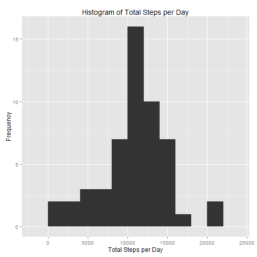
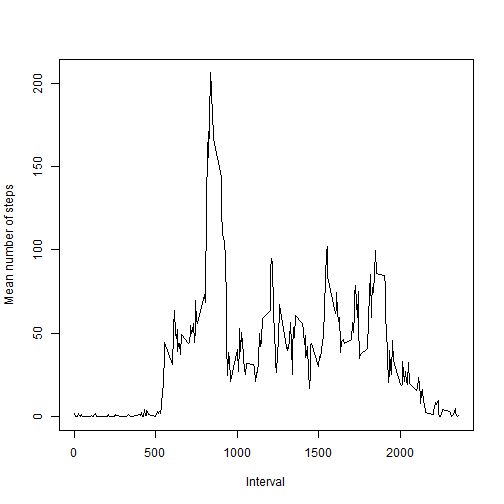
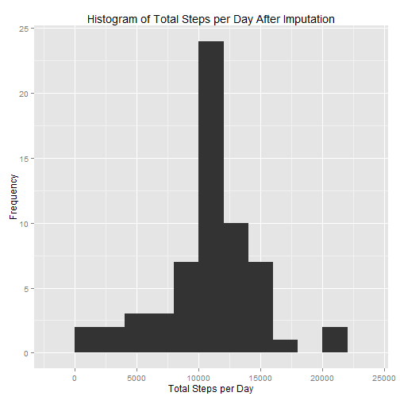
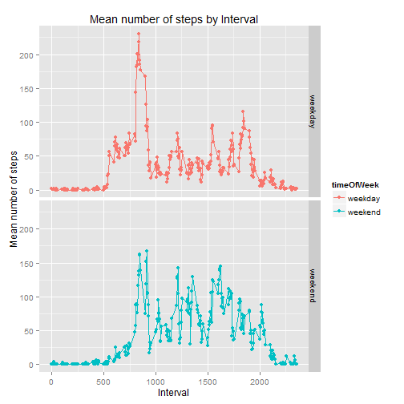

## Loading and preprocessing the data

```r
#include libraries needed
library(ggplot2)
library(reshape2)
#First extract the csv file from the file activity.zip
if(!file.exists('activity.csv')) {
    unzip('activity.zip')
}
#read csv
activity.data <- read.csv('activity.csv', colClasses = c('numeric', 'character', 'numeric'))
#Convert date into a date time object
activity.data$date <- as.Date(activity.data$date)
#also have a data frame that contains just the complete cases
activity.data.complete <- activity.data[complete.cases(activity.data),]
```

## What is mean total number of steps taken per day?
The following R code calculates the total steps per day for each date and then displays a histogram of the total steps per day. It then calculates the mean and median steps per day and prints them.


```r
#calculate the sum 
sum.by.day <- aggregate(x = activity.data.complete$steps, by=list(activity.data.complete$date), sum)
qplot(x, data = sum.by.day, ylab='Frequency', xlab='Total Steps per Day', geom = "histogram", binwidth=2000, main = 'Histogram of Total Steps per Day')
```



```r
mean.steps <- mean(sum.by.day$x)
median.steps <- median(sum.by.day$x)

sprintf("Mean Total Steps per day: %.2f", mean.steps)
```

```
## [1] "Mean Total Steps per day: 10766.19"
```

```r
sprintf("Median Total Steps per day: %.0f", median.steps)
```

```
## [1] "Median Total Steps per day: 10765"
```
As reported above the mean of the total steps per day is 10766.189. The median of the total steps per day is 10765.

## What is the average daily activity pattern?
In this section we look at the average daily activity pattern based on the 5 minute interval.

```r
#melt the activity complete cases by interval as ids and steps as the measured variable
melted.activity <- melt(data = activity.data.complete, id.vars = c('interval'), measure.vars = c('steps'))
#calculate the mean number of steps per interval over all dates
mean.steps.byInterval <- dcast(data = melted.activity, interval~variable, mean)

plot(x = mean.steps.byInterval$interval, y = mean.steps.byInterval$steps , type = 'l', xlab = 'Interval', ylab = 'Mean number of steps')
```



```r
#get the interval with the maximum mean steps
max.interval <- mean.steps.byInterval[which.max(x = mean.steps.byInterval$steps),]
sprintf("Interval with hightest average steps across all days: %d (%.2f mean steps across all days)", max.interval$interval, max.interval$steps)
```

```
## [1] "Interval with hightest average steps across all days: 835 (206.17 mean steps across all days)"
```

## Imputing missing values
In this section we will be reporting the total number of missing values. The next step will be to impute the missing values by filling in the missing values with the mean for that 5-minute interval. Next we will create a new data set with all the missing values filled in as described and finally we create a new histogram of the total number of steps and report the mean and median for the newly created data set with imputed missing values.


```r
#get the rows that have missing values
missing.rows<- which(is.na(activity.data$steps))
#Print out the total number of missing values
sprintf("Total number of missing values: %d", length(missing.rows))
```

```
## [1] "Total number of missing values: 2304"
```

```r
#loop over all missing rows and replace the value of steps with the average number of steps for that interval
for(i in missing.rows){
    activity.data[i,'steps'] <- mean.steps.byInterval[mean.steps.byInterval$interval == activity.data[i,'interval'],'steps']
}

sum.by.day.imput <- aggregate(x = activity.data$steps, by=list(activity.data$date), sum)
qplot(x, data = sum.by.day.imput, ylab='Frequency', xlab='Total Steps per Day', geom = "histogram", binwidth=2000, main = 'Histogram of Total Steps per Day After Imputation')
```



```r
mean.steps.imput <- mean(sum.by.day.imput$x)
median.steps.imput <- median(sum.by.day.imput$x)

sprintf("Mean Total Steps per day after Imputation: %.2f", mean.steps.imput)
```

```
## [1] "Mean Total Steps per day after Imputation: 10766.19"
```

```r
sprintf("Median Total Steps per day after Imputation: %.0f", median.steps.imput)
```

```
## [1] "Median Total Steps per day after Imputation: 10766"
```

The above shows that in the data set imputation does cause the Total Steps per Day frequency in some bins to increase by quite a bit. The 10k - 15k bins are impacted the most. Also there are more days counted that were previously removed because all measurements for that day had missing values. This also does impact the mean and median of the total steps per day but not too much because we used the mean of the steps at those intervals to fill the missing values.  

## Are there differences in activity patterns between weekdays and weekends?

For this part of the project we will add a new factor with two levels "weekday" and "weekend". Then plot the results showing the Mean number of steps per Interval for both weekday and weekend groups


```r
#Add the timeOfWeek column to indicate weekday or weekend. Replace Saturday
#and Sunday with "weekend" and Monday|Tuesday|Wednesday|Thursday|Friday with "weekday"
activity.data[,"timeOfWeek"] <- gsub(pattern = "Saturday|Sunday", replacement = "weekend" , x = weekdays(activity.data$date))
activity.data[,"timeOfWeek"] <- gsub(pattern = "Monday|Tuesday|Wednesday|Thursday|Friday", replacement = "weekday", x = activity.data$timeOfWeek)
#Make it a factor
activity.data$timeOfWeek <- as.factor(activity.data$timeOfWeek)

#melt is and then get average steps for each interval and time of week
melted.activity.full <- melt(data = activity.data, id.vars = c('interval', 'timeOfWeek'), measure.vars = c('steps'))
mean.steps.full <- dcast(data = melted.activity.full, interval+timeOfWeek~variable, mean)

#now we plot both time series
qplot(data = mean.steps.full, x = interval, y = steps, facets = timeOfWeek~., main = 'Mean number of steps by Interval', xlab = 'Interval', ylab = 'Mean number of steps', col=timeOfWeek) + geom_line()
```



